# Sister's Outfits

Domain specification for the storefront, checkout, WhatsApp support, loyalty, orders, and admin console of a Pakistani ladies boutique selling **stitched** and **unstitched** suits (retail, English, single retail price). Use during development and full-site audits.

---

## Documentation

| Document                                             | Purpose                                                                          |
| ---------------------------------------------------- | -------------------------------------------------------------------------------- |
| [Setup & onboarding](docs/setup.md)                  | Install, env vars, local dev, troubleshooting                                    |
| [Go-live runbook](docs/go-live.md)                   | Production deploy, integrations, smoke test, launch checklist                    |
| [Architecture](docs/architecture.md)                 | Monorepo layout, apps, packages, MongoDB, security boundaries                    |
| [Catalog operations](docs/catalog.md)                | Products, attributes, pools, variants in Admin                                   |
| [Website audit guide](docs/website-audit.md)         | Checklist for auditing storefront + admin                                        |
| [Engineering handbook](docs/engineering-handbook.md) | Project standards, optimizations inventory, vibeCodingRules gaps, new-dev rules  |
| [SEO automation plan](docs/seo-automation-plan.md)   | Intent surfaces, AI batch copy, glossary, feeds (GEO/AIO + organic + Shopping)   |
| [Design system](docs/design-system.md)               | Color tokens, typography, motion budget summary                                  |
| [Storefront design](docs/storefront-design.md)       | Homepage grammar, chrome, motion, shop handoff — follow before redesigning pages |

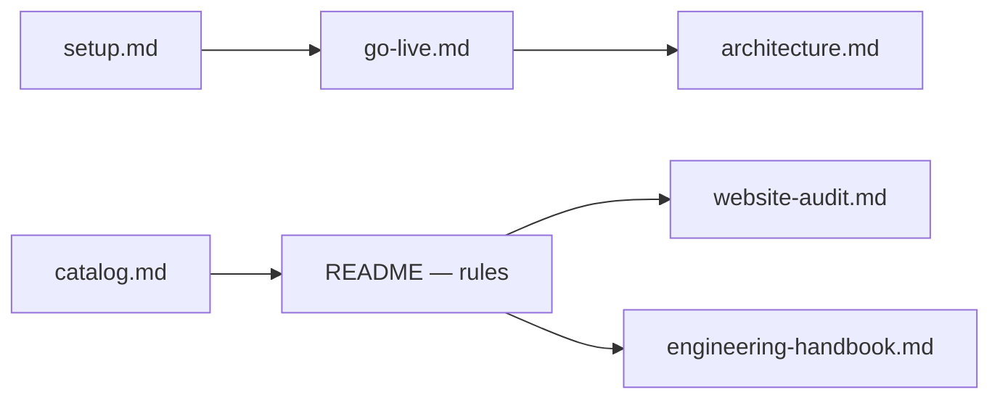

**Apps:** Storefront `@store/web` (port 3000) · Admin `@store/admin` (port 3001) · Packages `@store/db`, `@store/shared`, `@store/ui`.

---

## 1. Catalog & domain rules

### Data source

- **MongoDB** is the catalog source of truth — categories, attributes, brands, products, variants.
- **Admin CRUD** or `npm run seed:catalog` (wipe + reseed). Categories are look/occasion (Daily Wear, Embroidered, Formals, Festive). **Type** (Stitched | Unstitched) is a filterable attribute — not a category.
- **Orders are snapshots** — each line stores `productName`, `variantSummary`, `unitPriceRupees` at placement.
- **No grades** — variants are attribute combinations only (size, colour, fabric, …). Run `scripts/remove-grades.mjs` once against legacy DBs that still store `gradeSlug`.

### Attribute model

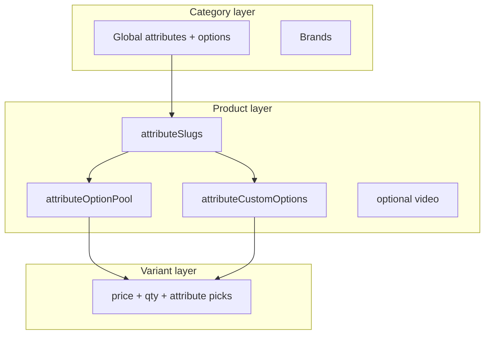

| Layer                  | Where                                                    | Purpose                                                                                              |
| ---------------------- | -------------------------------------------------------- | ---------------------------------------------------------------------------------------------------- |
| **Category attribute** | `attributes` collection                                  | Shared dimensions (Size, Colour, Fabric, Pieces, Length, …) with `options[]` for filters and labels. |
| **Product config**     | `attributeSlugs`, pools, custom options, defaults        | Which dimensions apply; whitelisted values; product-only values.                                     |
| **Product media**      | `images[]`, optional `video`, optional `descriptionHtml` | **1–20** shared images (any count); one optional video; rich HTML description for PDP.               |
| **Variant row**        | `products.variants[]`                                    | SKU: `priceRupees`, `quantity`, `forceOutOfStock`, `warrantyDays`, attributes.                       |

**Rule:** Variant values must sit in the product pool. Duplicate attribute combinations on the same product are rejected.

### Visibility cascade

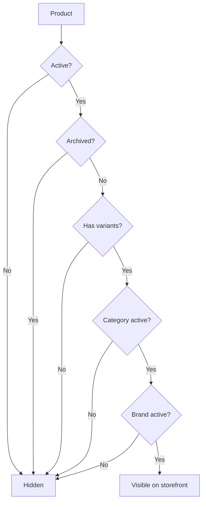

### Core entities

| Entity        | Key rules                                                                                                                           |
| ------------- | ----------------------------------------------------------------------------------------------------------------------------------- |
| **Category**  | Slug, marketing content, SEO. Inactive → all products hidden.                                                                       |
| **Brand**     | Per-category scope. Product form filters brands by category.                                                                        |
| **Attribute** | Filter visibility (always / by brand); card position on listings.                                                                   |
| **Product**   | **1–20** shared images (any count); optional `video`; optional rich HTML `descriptionHtml`; `isActive`, `isArchived`, `isFeatured`. |
| **Variant**   | In stock when `quantity > 0` and not `forceOutOfStock`. Stock reserved at order placement.                                          |

---

## 2. Storefront shell & navigation

### Layout map

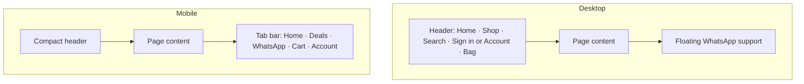

| Surface             | Behavior                                                                                                                                                  |
| ------------------- | --------------------------------------------------------------------------------------------------------------------------------------------------------- |
| **Desktop header**  | Home and Shop at the left, centered brand, then Search, Sign in or Account, and Bag at the right.                                                         |
| **Mobile tab bar**  | Home, Deals, **WhatsApp**, Cart, Account. The center action opens WhatsApp directly.                                                                      |
| **Desktop support** | A floating “WhatsApp Us!” pill appears on every customer-facing page.                                                                                     |
| **Global footer**   | One clean desktop row for brand, tagline, copyright, and developer credit. Legal copy stays together on mobile; WhatsApp and social icons remain outside. |
| **Notice banner**   | Optional; dismissible per session (Settings → Notices).                                                                                                   |
| **Page transition** | Internal navigation shows a looping thread-and-hanger preloader that draws A→B then reverses B→A until the destination is ready.                          |
| **Deferred search** | The search overlay loads after idle (~1.5s) to reduce initial blocking.                                                                                   |

### Route map

| Route                      | Behavior                                                                                                                                                                                                                      |
| -------------------------- | ----------------------------------------------------------------------------------------------------------------------------------------------------------------------------------------------------------------------------- |
| `/`                        | Editorial boutique homepage — full-screen entrance, horizontal category runway, product stage, fabric-to-suit craft chapters, tailoring guidance, and store contact map. `/?q=` keeps global search (24/page, max 100 chars). |
| `/{category}`              | Compact editorial category header, listing, and URL filters. Inactive categories show coming soon.                                                                                                                            |
| `/{category}/{slug}`       | PDP (Vertical Runway); wrong category in URL redirects to the canonical route.                                                                                                                                                |
| `/deals`                   | Catalog deal pills + checkout offer chips + product grid.                                                                                                                                                                     |
| `/cart`                    | Full-page cart (browser storage).                                                                                                                                                                                             |
| `/checkout`                | **Guest checkout** — anyone can place an order (name + WhatsApp number). Members get member discount + loyalty.                                                                                                               |
| `/checkout/success?order=` | Order confirmation.                                                                                                                                                                                                           |
| `/account/*`               | Protected except `/account/sign-in` and `/account/setup/[token]`.                                                                                                                                                             |

Reserved segments (not categories): `about`, `account`, `api`, `attributes`, `cart`, `checkout`, `concepts`, `deals`.

---

## 3. Search, shop & deals

### Search overlay flow

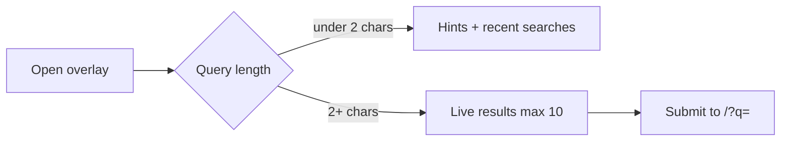

| Rule            | Value                                                    |
| --------------- | -------------------------------------------------------- |
| Debounce        | ~220ms                                                   |
| Recent searches | 5 in browser storage                                     |
| API rate        | 60/min/IP                                                |
| Search backend  | Atlas Search when index exists; regex fallback otherwise |

### Category listing

**Layout:** Gate · hang tags — Allura category stage, blush hang-tag dock (categories + brands + open Min—Max), denser product wall.

| Filter (AND)  | URL param     | Dock UI       |
| ------------- | ------------- | ------------- |
| Category      | path segment  | Hang tags     |
| Brand         | `brand`       | Hang tags     |
| Price         | `min`, `max`  | Open Min—Max  |
| In stock only | `stock=1`     | URL only      |
| Sort          | `sort`        | URL only      |
| Search        | `q`           | Header search |
| Attributes    | `attr.{slug}` | URL only      |

**Pagination:** 24/page (max 60); infinite scroll + load-more fallback.

### Deals surfaces

```mermaid
flowchart LR
  CD[Catalog deal] --> DEALS[/deals pills]
  CD --> CARD[Card badge]
  CD --> PDP[PDP pill + auto-apply]
  CO[Checkout offer] --> CHIPS[Deals header chips]
  CO --> CART[Cart + checkout]
```

---

## 4. Product detail (PDP)

**Layout:** Vertical Runway — centered Allura title, looping parallax look ribbon, rich description, sticky attribute dropdowns + Add to bag, More from rail.

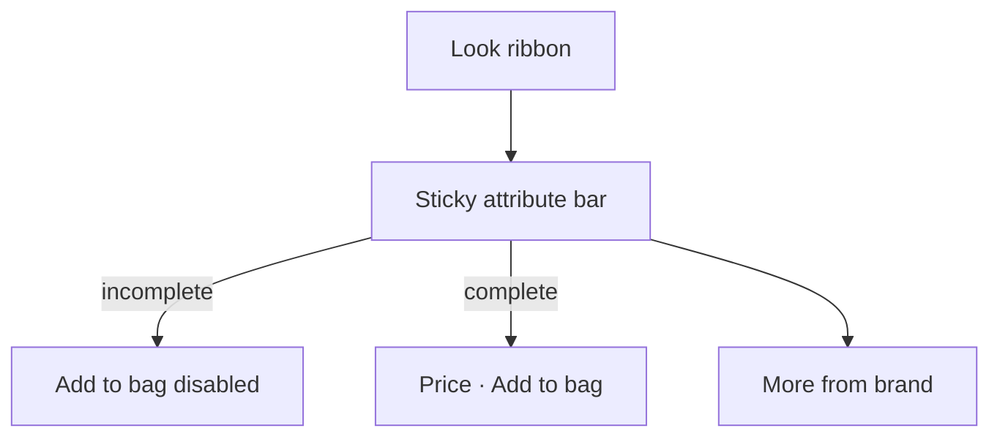

| Feature       | Rule                                                                                                                        |
| ------------- | --------------------------------------------------------------------------------------------------------------------------- |
| Breadcrumb    | **Home → category → product name** only (no brand / site name crumb).                                                       |
| Gallery       | Product images as look ribbon; click side looks to center; center click opens full view; **Look 01** index on active frame. |
| Description   | Optional rich HTML under “After the runway”; measure-balanced prose; hidden when empty.                                     |
| URL sync      | Attribute slugs only; invalid combos reset client-side.                                                                     |
| Sticky bar    | One dropdown per product attribute; Add to bag requires a complete in-stock selection.                                      |
| Catalog deals | Offer price applied in the sticky bar when a catalog deal matches the selected variant.                                     |
| Related       | Same category + brand — show **4** from pool of **8**.                                                                      |

### Sizing & fit

A **Size & fit** dialog opens from a trigger beside the size selector (stitched) or inline in the product body (unstitched). It resolves one **size chart** per product through an inheritance chain and adapts to the garment type.

**Chart inheritance (most specific wins):**

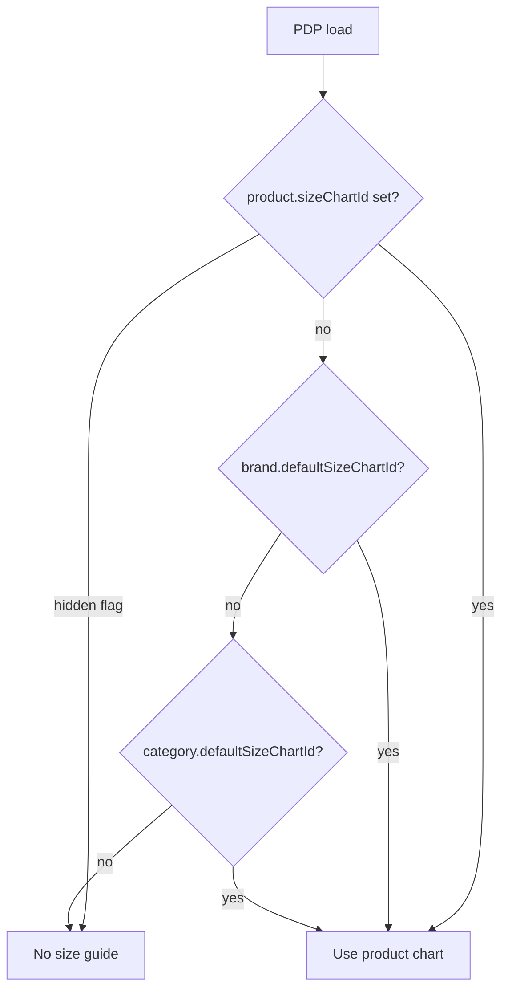

- **Resolution** happens server-side in the PDP loader and is cached on the `storefront` tag (60s); admin size-chart / product / brand / category edits bust the tag.
- **Chart storage:** measurements are stored canonically in **inches**; the storefront derives cm on display. Row `sizeValue`s mirror the `size` attribute options (`xs`..`xl`).
- **Hide:** a product can hide the guide entirely (overrides inheritance).

**Stitched garments** (`type` = `stitched`, has a `size` axis) - full experience when a chart resolves:

| Surface        | Behaviour                                                                                                                                                                                                                                                                                                                                                                                                                                                                                                                                                                                                                          |
| -------------- | ---------------------------------------------------------------------------------------------------------------------------------------------------------------------------------------------------------------------------------------------------------------------------------------------------------------------------------------------------------------------------------------------------------------------------------------------------------------------------------------------------------------------------------------------------------------------------------------------------------------------------------- |
| Size chart     | Table with an in/cm toggle; the currently selected variant size row is highlighted as **Your size**.                                                                                                                                                                                                                                                                                                                                                                                                                                                                                                                               |
| Find my size   | Opens with the first shape selected and every input filled from its realistic survey-informed preset. Bust, waist, hip, height, shoulder-to-wrist arm length, and waist-to-floor length support in/cm entry. Broad plausible adult ranges are enforced with field-level errors. Sleeve length follows arm length automatically; inseam, thigh circumference, and upper-arm circumference derive from guarded adult-female anthropometric ratios plus the shopper's height, hip, and bust. **Use this size** drives the variant selection.                                                                                          |
| Recommendation | Rounds up to the smallest row that fits every entered measurement with a matching chart column. Automatic sleeve, inseam, thigh, and upper-arm estimates shape the preview only and do not affect the recommendation. Guidance only, not a guarantee.                                                                                                                                                                                                                                                                                                                                                                              |
| Fit preview    | Starts with the first shape's 37 in bust / 29 in waist / 38 in hip / 64 in height survey-informed preset. Circumferences become front-view widths through elliptical body cross-sections with separate bust, waist, hip, thigh, and upper-arm depth ratios. The full-proportion figure adjusts skeletal width, limb thickness, arm length, waist-to-floor length, rise, automatically estimated inseam, and knee position within guarded limits. Arms use a straight natural A-pose. Changes animate smoothly unless the device requests reduced motion. Garment hemline overlays appear when height + length columns are present. |

- **Rule:** the trigger only appears for stitched products when a chart resolves.

**Unstitched garments** (`type` = `unstitched`, no ready size) - made-to-measure framing, **no size recommender**:

- Explains there is no ready size and shows the selected **pieces** and **fabric**.
- Lists the **measurements to give your tailor** (shoulder, bust, waist, hip, kameez length, sleeve, trouser/shalwar length).

---

## 5. Cart & checkout

### Checkout journey

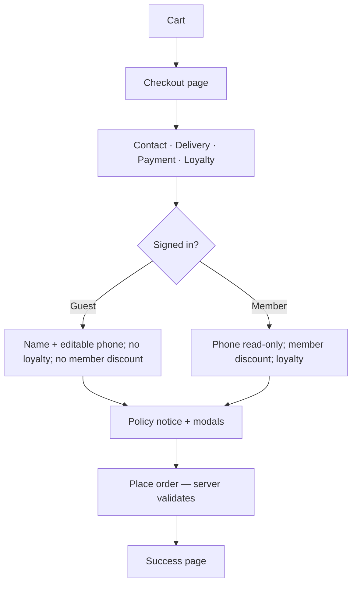

**Guest checkout:** No sign-in required. The full form renders for everyone; guests enter their name and WhatsApp number, and the server upserts a phone-keyed `Customer` (non-member, non-loyalty). Signed-in members get their phone pre-filled and read-only, unlock loyalty redemption, and receive the member discount.

### Price calculation (server only)

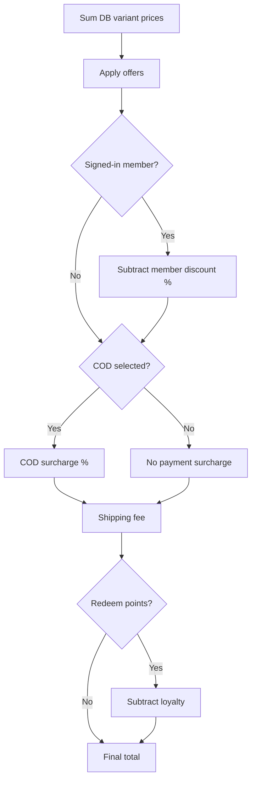

**Order of operations:** offers → **member discount** (signed-in members only, `memberDiscountPercent`) → COD surcharge and shipping (both computed on the post-member subtotal) → loyalty redemption. Guests never receive the member discount even if a `Customer` record exists for their phone.

### Cart limits

| Rule           | Value                                |
| -------------- | ------------------------------------ |
| Max lines      | 20 product+variant pairs             |
| Max qty / line | 10 (or stock cap)                    |
| Storage        | Browser localStorage; cross-tab sync |
| Catalog offers | Locked on line at add-to-cart        |

### Checkout steps

| Step                | Rules                                                                                                                                                                                                                                                                                                                                                                                                                                                          |
| ------------------- | -------------------------------------------------------------------------------------------------------------------------------------------------------------------------------------------------------------------------------------------------------------------------------------------------------------------------------------------------------------------------------------------------------------------------------------------------------------- |
| **Contact**         | Name min 2 chars. **Guests:** WhatsApp number editable, min 7 chars, required. **Members:** phone read-only from account.                                                                                                                                                                                                                                                                                                                                      |
| **Delivery**        | **Pickup** — free. **Courier** — flat fee (default **Rs 1,500**, admin-configurable) unless subtotal **after offers** ≥ threshold (default **Rs 50,000**) → free, or a checkout offer grants free shipping. Address min 2 chars for courier.                                                                                                                                                                                                                   |
| **Payment**         | **Bank transfer**, **cash on delivery**, or **pay online** (optional). Admin toggles each method. **Bank transfer (default):** transfer online → send payment screenshot on WhatsApp → admin confirms. **COD:** order confirms immediately; pay cash on delivery. **Pay online:** PayFast or Rapid Gateway when enabled under Integrations (admin picks one). **COD surcharge:** admin % on merchandise subtotal after offers. Optional chip notes per method. |
| **Member discount** | Signed-in members only. `memberDiscountPercent` (default **10%**, admin-configurable 0–100) off the subtotal after offers. Shown as its own summary line. Guests and loyalty-only customers do not receive it.                                                                                                                                                                                                                                                 |
| **Loyalty**         | Signed-in members only. Min **100** pts; max **20%** of subtotal after member discount; 1 pt = Rs 1. Blocked when checkout offer disallows points.                                                                                                                                                                                                                                                                                                             |
| **Policies**        | Placing order agrees to return + privacy policies. Links open **modals** with admin HTML — no checkbox.                                                                                                                                                                                                                                                                                                                                                        |
| **Placement**       | Idempotency key **required**; max **5** orders / **15 min**; atomic stock reservation; server re-prices every line from DB.                                                                                                                                                                                                                                                                                                                                    |

### Checkout security (server authority)

| Rule            | Behavior                                                                                                                                                                             |
| --------------- | ------------------------------------------------------------------------------------------------------------------------------------------------------------------------------------ |
| **Pricing**     | Totals computed only on server from live variant prices — client cart amounts are never trusted.                                                                                     |
| **Offers**      | Only active + eligible offers apply; discount capped at subtotal; catalog line offer must match server lock; usage reserved atomically before order create (rolled back on failure). |
| **Idempotency** | `idempotencyKey` required on `POST /api/orders` — duplicate parallel submits return the same order.                                                                                  |
| **Stock**       | Reserved at placement; released on cancel / refund / return paths.                                                                                                                   |
| **Payments**    | PayFast hash verified with constant-time compare; Rapid webhook signature checked; paid amount required to auto-confirm card orders.                                                 |
| **Rate limits** | Checkout, cancel, OTP, chat, and public catalog APIs rate-limited per IP + identifier.                                                                                               |

### Payment methods (checkout)

| Method           | ID              | Notes                                                                                                                                                                                                                                                       |
| ---------------- | --------------- | ----------------------------------------------------------------------------------------------------------------------------------------------------------------------------------------------------------------------------------------------------------- |
| Bank transfer    | `bank-transfer` | Toggle: `paymentBankTransferEnabled` (default on). Enter bank name + account number or IBAN in **Settings → Payments** — chip hidden and API blocked until details exist. Order stays **`pending-payment`** until admin confirms after WhatsApp screenshot. |
| Cash on delivery | `cod`           | Toggle: `paymentCodEnabled`; surcharge: `codSurchargePercent`. Order status **`confirmed`** on placement; pay cash when the parcel arrives.                                                                                                                 |
| Pay online       | `card`          | Toggle: `paymentCardEnabled` (default off). **PayFast** or **Rapid Gateway** — admin picks active provider in **Settings → Integrations**. Auto-confirms via webhook or PayFast return callback.                                                            |

---

## 6. Authentication & account

Accounts are **membership-gated and password-based**. There is no self-serve signup — the store invites members. Shopping and checkout never require an account (see guest checkout). The WhatsApp OTP provider remains in the codebase but is **dormant** until the client has a Meta-verified number; it can be re-enabled without a rebuild.

### Membership request → invite → setup flow

```mermaid
sequenceDiagram
  actor Visitor
  participant UI as Sign-in page
  participant API as Membership API
  participant Admin as Admin console
  participant WA as WhatsApp

  Visitor->>UI: "Request membership" (name + phone)
  UI->>API: POST /api/membership/requests
  API-->>Visitor: Request stored (pending); opens WhatsApp to admin
  Admin->>Admin: Membership requests page → "Generate setup link"
  Admin->>WA: Sends single-use setup link to the member
  Visitor->>UI: Opens /account/setup/[token] → sets password
  UI->>API: POST /api/account/setup → member created, request completed
  Visitor->>UI: Auto sign-in via phone + password
```

| Stage               | Rules                                                                                                                                                                               |
| ------------------- | ----------------------------------------------------------------------------------------------------------------------------------------------------------------------------------- |
| **Identity**        | Phone number + password (bcrypt). One `Customer` per normalized phone.                                                                                                              |
| **Request**         | Public `POST /api/membership/requests` (name + phone). Deduped by phone fingerprint; ignored if already a member or an open request exists. Status starts **`pending`**.            |
| **Admin invite**    | `customer_update` permission. Generates a **single-use** setup token (SHA-256 stored, raw shown once), sets status **`invited`** with an expiry. Admin can **decline**/**re-open**. |
| **Setup**           | `/account/setup/[token]` validates the hashed token (invited + unexpired), sets the password, marks `isMember: true` + `memberSince`, closes the request (**`completed`**).         |
| **Sign-in**         | `customer-password` provider verifies phone + password. Session cookie **30 days**. Timing-decoy hash on unknown phone.                                                             |
| **Forgot password** | No self-serve reset — WhatsApp deep link to the store; admin re-issues a setup link.                                                                                                |
| **Rate limits**     | Password sign-in and membership requests rate-limited per IP + phone.                                                                                                               |
| **Dormant OTP**     | `customer-otp` provider retained (6 digits, 5 min TTL, 5 guesses) but not surfaced in the UI; enable when Meta WhatsApp is live.                                                    |
| **Addresses**       | Max **6**; cannot delete last                                                                                                                                                       |
| **Sign-out**        | Clears session, guest chat cookies, cart                                                                                                                                            |

### Member perks

- **Member discount** — `memberDiscountPercent` off every order subtotal after offers (see Cart & checkout).
- **Loyalty points** — earn/redeem available only to signed-in members.

### Account pages

| Page                     | Content                                                                                        |
| ------------------------ | ---------------------------------------------------------------------------------------------- |
| `/account`               | Stats, order filters, loyalty card                                                             |
| `/account/profile`       | Name, city, addresses                                                                          |
| `/account/orders/[id]`   | Timeline, items, payment, loyalty, **cancel** while `pending-payment` or `confirmed`           |
| `/account/sign-in`       | Member sign-in (phone + password) with "Request membership" and "Forgot password" via WhatsApp |
| `/account/setup/[token]` | Guided password setup from an admin-issued invite link                                         |

---

## 7. WhatsApp support

- **Customer entry:** Every storefront route exposes direct WhatsApp support; the website does not open an on-site chatbot.
- **Desktop:** Bottom-right floating green pill labeled “WhatsApp Us!”.
- **Mobile:** Elevated center WhatsApp action inside the five-item bottom navigation.
- **Destination:** Both actions use the admin-managed WhatsApp number, the official WhatsApp icon, route-specific wording, and the complete current URL including search or filter parameters.
- **Unavailable number:** The desktop pill is hidden and the mobile action is disabled when the configured number is invalid.

---

## 8. Loyalty & offers

### Offer types

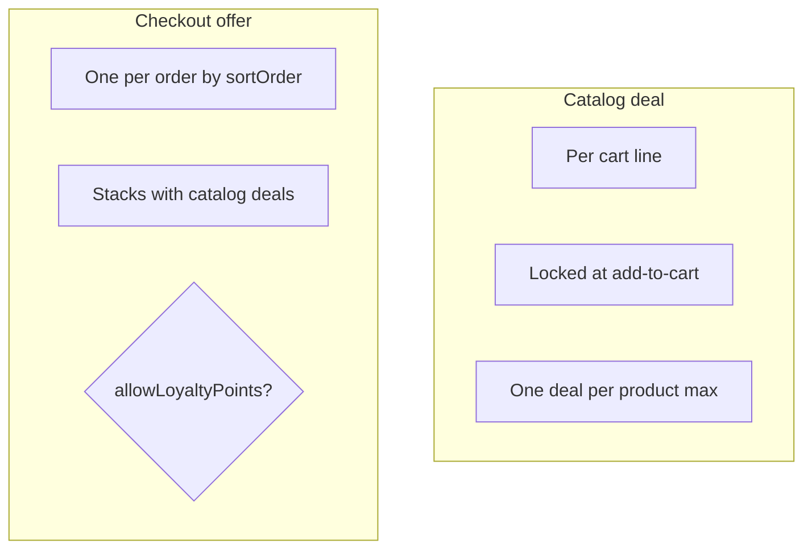

| Type                | Surfaces                    | Evaluation                                                    |
| ------------------- | --------------------------- | ------------------------------------------------------------- |
| **Catalog deal**    | `/deals`, cards, PDP        | Per line; cart-total/payment rules ignored on display         |
| **Checkout offer**  | Deals chips, cart, checkout | Cart total / payment method; may block loyalty                |
| **Member discount** | Checkout (members only)     | `memberDiscountPercent` after offers — not an offer, no rules |
| **COD surcharge**   | Checkout only               | Admin % — not an offer                                        |

**Actions:** percentage discount, fixed Rs off, free shipping.

**Conditions:** product, category, brand, attribute, price range, cart total, min line qty, payment method.

### Loyalty

| Rule                    | Default                                                                                                                                |
| ----------------------- | -------------------------------------------------------------------------------------------------------------------------------------- |
| Earn                    | `loyaltyEarnPercent` of **payable order total** (after offers, COD fee, delivery, minus redemption)                                    |
| Credit                  | On status → `delivered`                                                                                                                |
| Reversal (earned)       | On `cancelled` / `refunded` after delivered — not on `returned`                                                                        |
| Redeem refund           | On `cancelled` / `refunded` / `returned` — points debited at checkout are credited back                                                |
| Redeem                  | Min **100** pts; max **20%** of subtotal **after offers**; 1 pt = Rs 1                                                                 |
| **Balance at checkout** | `POST /api/loyalty-balance` requires a signed-in customer session; returns only the authenticated customer's balance (no phone lookup) |

---

## 9. Order lifecycle

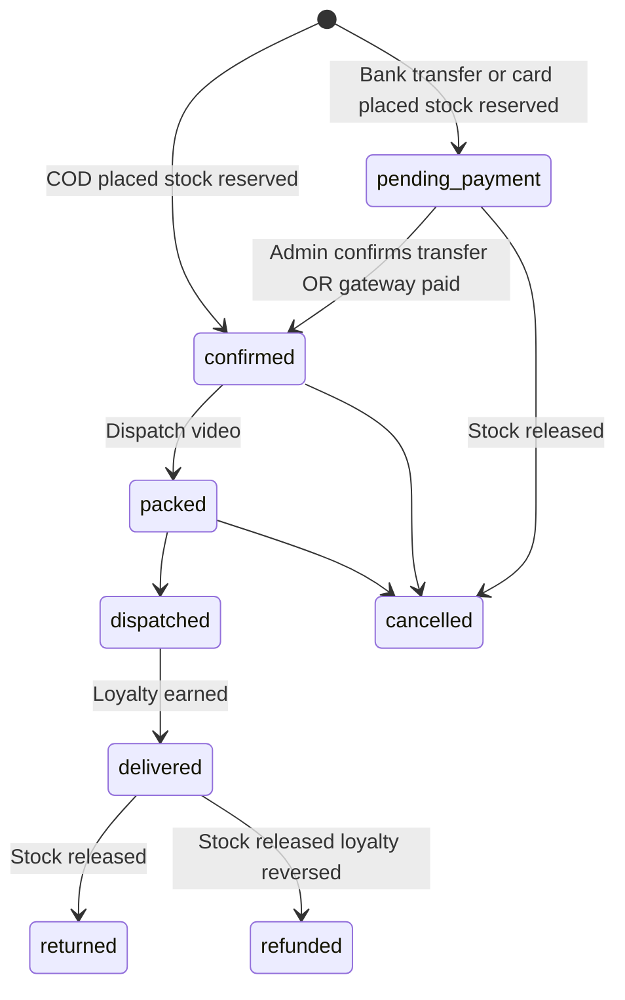

| Status                                | Admin / system behavior                                                                                                                                                                             |
| ------------------------------------- | --------------------------------------------------------------------------------------------------------------------------------------------------------------------------------------------------- |
| `pending-payment`                     | **Bank transfer or pay online** — awaiting WhatsApp screenshot (bank) or gateway payment; editable lines, address, payment, delivery                                                                |
| `confirmed`                           | **COD lands here on place**; bank transfer after admin confirms; pay online after PayFast/Rapid confirms. Locked from line edits; fulfillment moves **one step at a time** (no skip to `delivered`) |
| `packed`                              | Requires `dispatchVideoUrl`                                                                                                                                                                         |
| `dispatched`                          | No backward step on happy path                                                                                                                                                                      |
| `returned`                            | Only from `delivered`                                                                                                                                                                               |
| `delivered`                           | Credits loyalty                                                                                                                                                                                     |
| `cancelled` / `refunded` / `returned` | Stock released; earned loyalty reversed on refund after delivered; redeemed points refunded                                                                                                         |
| **Customer cancel**                   | Account order detail → **Cancel order** while `pending-payment` or `confirmed` (releases stock, refunds redeemed points)                                                                            |
| **Admin bank-transfer panel**         | Pending bank-transfer orders show store account details on admin order detail for screenshot matching                                                                                               |

Staff and customer alerts fire **after** successful writes (non-blocking — failure never blocks the order or chat reply).

### Staff recipients

| Channel      | Recipients                                                                                                                           |
| ------------ | ------------------------------------------------------------------------------------------------------------------------------------ |
| **Email**    | Every active admin `users` row with email + `staffNotifyEmail` (Integrations) + store support email                                  |
| **WhatsApp** | `staffNotifyWhatsApp` (Integrations) + phone on every active admin user (shop events); inquiries also notify assignee phone when set |

### Customer WhatsApp

Requires customer phone on order snapshot or inquiry thread + `whatsappCustomerOrderTemplate` in Integrations.

### Event matrix

| Event                                | Staff email |     Staff WhatsApp      | Customer WhatsApp |
| ------------------------------------ | :---------: | :---------------------: | :---------------: |
| Order placed                         |     Yes     |           Yes           |        Yes        |
| Order status changed                 |     Yes     |           Yes           |        Yes        |
| Payment confirmed (gateway or admin) |     Yes     |           Yes           |        Yes        |
| Order cancelled                      |     Yes     |           Yes           |        Yes        |
| Customer chat message                |     Yes     | Yes (global + assignee) |         —         |
| Inquiry escalated (AI / keywords)    |     Yes     | Yes (global + assignee) |         —         |
| Agent reply                          |      —      |            —            |        Yes        |

**Limit:** Low-stock variants surface in Admin dashboard + bell only — no email/WhatsApp for inventory thresholds today.

**Config:** Admin → Settings → Integrations (Resend, Meta WhatsApp, template names). Shop Health warns when any channel is misconfigured.

---

## 9b. Storefront performance & motion

| Layer                | Behavior                                                                                                                                                                                                                                                                                                                                                                                                                                                                                                                                             |
| -------------------- | ---------------------------------------------------------------------------------------------------------------------------------------------------------------------------------------------------------------------------------------------------------------------------------------------------------------------------------------------------------------------------------------------------------------------------------------------------------------------------------------------------------------------------------------------------- |
| **ISR**              | Hot pages revalidate every **30s**; router stale cache tuned for snappy back/forward.                                                                                                                                                                                                                                                                                                                                                                                                                                                                |
| **Boot warm**        | On server start: Mongo connect + storefront read caches (settings, categories, brands, attributes).                                                                                                                                                                                                                                                                                                                                                                                                                                                  |
| **Prefetch**         | Idle prefetch of home, deals, about, cart, and top category routes.                                                                                                                                                                                                                                                                                                                                                                                                                                                                                  |
| **Images**           | Next.js optimizer — AVIF/WebP; long cache TTL on product photos.                                                                                                                                                                                                                                                                                                                                                                                                                                                                                     |
| **Deferred UI**      | The search overlay loads after idle to protect first paint; WhatsApp support remains lightweight and immediately available.                                                                                                                                                                                                                                                                                                                                                                                                                          |
| **Motion**           | Premium pacing is intentional: longer, smoother hero and section entrances, image parallax, and a desktop horizontal category runway. Fabric-to-suit chapters hold longer between sticky cards; the previous card blurs and scales back as the next replaces it. Desktop uses soft Couture Lenis inertia (synced with GSAP); phones keep native touch. Page transitions use a looping reverse thread preloader. Reduced-motion disables Lenis. Catalog, filters, cart, checkout, and account stay free of scroll hijacking beyond that soft inertia. |
| **Build resilience** | Store settings, SEO metadata, chat settings, and layout reference data fall back to defaults when Mongo is unreachable at build or boot — pages still render; ISR refreshes on next request.                                                                                                                                                                                                                                                                                                                                                         |

---

## 10. Admin console

### Workspace map

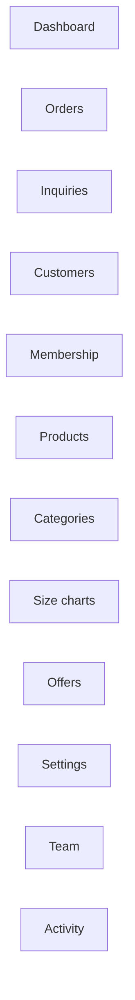

| Workspace       | Permission (typical)                | Key actions                                                             |
| --------------- | ----------------------------------- | ----------------------------------------------------------------------- |
| **Orders**      | `order_view` / `order_update`       | Stepper, edits while pending-payment, cancel, invoice                   |
| **Inquiries**   | `inquiry_view` / `inquiry_reply`    | Reply, attach, **pause/resume bot**, assign                             |
| **Customers**   | `customer_view`                     | Profile, loyalty, sign-in code                                          |
| **Membership**  | `customer_view` / `customer_update` | List requests; **generate/copy single-use setup link**; decline/re-open |
| **Products**    | `product_*`                         | Wizard, variants, SEO                                                   |
| **Categories**  | `category_manage`                   | Categories, brands, attributes                                          |
| **Size charts** | `category_manage`                   | Measurement templates for the PDP size & fit dialog                     |
| **Offers**      | `offer_manage`                      | Banner, rules, publish                                                  |
| **Settings**    | `settings_view`                     | See §11                                                                 |
| **Team**        | `team_view`                         | Roles, invites                                                          |
| **Activity**    | `activity_view`                     | Audit log                                                               |

### Roles

| Role                  | Access                                     |
| --------------------- | ------------------------------------------ |
| **Owner**             | Full; `order_delete` + `data_cleanup`      |
| **Business manager**  | Catalog, orders, customers, chat, settings |
| **Product manager**   | Catalog CRUD + media                       |
| **Marketing manager** | Offers, categories, brands                 |
| **Support staff**     | Read ops data; inquiry reply               |

Super-admin bypasses all permission checks.

**Sign-in:** Email + password on `/login`. Password fields include show/hide toggle (login, account, team invite/reset, API key fields in chat settings).

---

## 11. Admin settings

| Tab               | Configures                                                                                                                                    |
| ----------------- | --------------------------------------------------------------------------------------------------------------------------------------------- |
| **Site URLs**     | `publicSiteUrl`                                                                                                                               |
| **Store details** | Name, tagline, logos, favicons                                                                                                                |
| **Contact**       | Phones, email, WhatsApp, address, hours                                                                                                       |
| **Payments**      | Card/COD toggles, COD %, chip notes                                                                                                           |
| **Delivery**      | Free-delivery threshold + courier flat fee                                                                                                    |
| **Notices**       | Global delivery note, site banner                                                                                                             |
| **Policies**      | Moneyback days, warranty months, return/privacy HTML → checkout modals                                                                        |
| **Loyalty**       | Earn % on delivered orders; **member discount %** (`memberDiscountPercent`, 0–100)                                                            |
| **Inventory**     | Low-stock threshold → dashboard + bell                                                                                                        |
| **SEO**           | Global meta, OG, Organization JSON-LD; product formula + AI copy; intent surfaces; glossary pages; merchant feed URL                          |
| **Chat**          | Widget, guest limit, assistant, **all provider API keys**, real-time transport, nudge                                                         |
| **Integrations**  | Social links, pixels, **PayFast / Rapid Gateway**, **Meta WhatsApp OTP**, Resend, staff/customer WhatsApp templates, **media storage status** |
| **Data cleanup**  | Owner-only bulk delete                                                                                                                        |

**Alerts bell:** unread inquiries + pending payments + low-stock (permission-scoped).

---

## 12. Storefront SEO (shipped)

| Surface               | URL / behavior                                                                                                                        |
| --------------------- | ------------------------------------------------------------------------------------------------------------------------------------- |
| **PDP**               | `/{category}/{slug}` — one **indexable** URL; aggregate title/description; FAQ + AggregateOffer JSON-LD                               |
| **PDP variant links** | `?attr.=` — **noindex**; variant-specific share title; canonical → clean PDP                                                          |
| **Intent landing**    | `/{category}?brand={slug}` — indexable when eligibility passes (≥2 products, ≥3 in-stock variants, copy exists); dedicated H1 + intro |
| **Thin filters**      | Any other active filter params → `noindex,follow`                                                                                     |
| **Glossary**          | `/attributes/{category}/{attribute}` — linked from filter pages ("What is …?")                                                        |
| **Sitemap**           | `/sitemap.xml` — categories, products, attribute glossary, indexable intent surfaces only                                             |
| **Merchant feed**     | `GET /api/feeds/merchant` (XML default; `?format=csv`); optional `Authorization: Bearer {MERCHANT_FEED_TOKEN}`                        |
| **Nightly reconcile** | `GET /api/cron/seo-reconcile` with `Authorization: Bearer {CRON_SECRET}` — refreshes `SeoSurface` stats and cache                     |

**Rule:** Copy is formula-first, AI-polished on save, human override optional. Attribute edits cascade affected product SEO and brand intent surfaces.

---

## 13. Limits reference

| Area                 | Limit                                          |
| -------------------- | ---------------------------------------------- |
| Cart lines           | 20                                             |
| Cart qty / line      | 10                                             |
| Courier delivery     | Rs 1,500; free above threshold                 |
| Payment methods      | Bank transfer, pay online, COD (admin toggles) |
| OTP (dormant)        | 6 digits / 5 min / 5 fails                     |
| Member discount      | `memberDiscountPercent` default 10% (0–100)    |
| Guest chat messages  | 5                                              |
| Loyalty redeem       | 100 min; 20% max subtotal (members only)       |
| Orders placed        | 5 / 15 min per customer                        |
| Search query         | 100 chars                                      |
| Products / page      | 24 (max 60)                                    |
| Admin login attempts | 8 / 15 min                                     |
