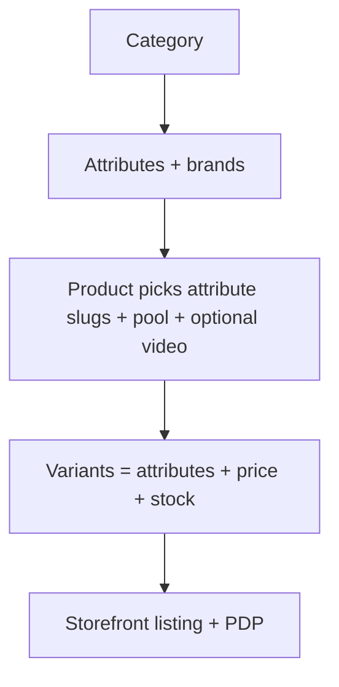
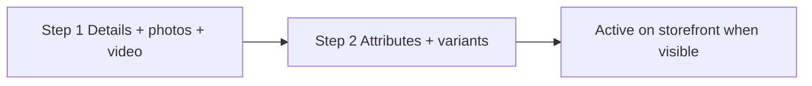
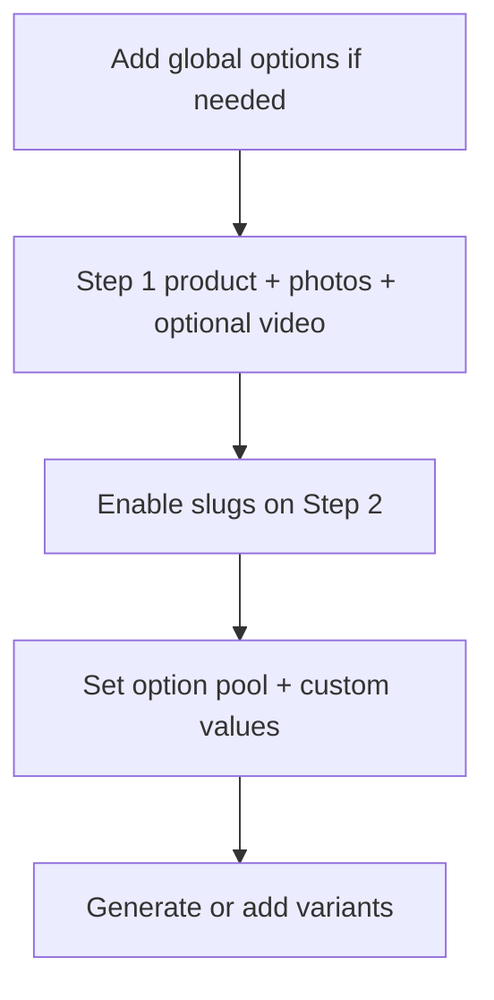
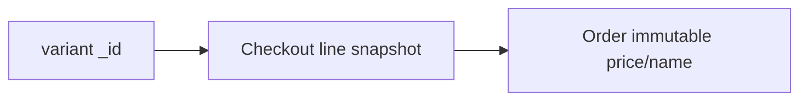

# Catalog operations

How products, attributes, pools, and variants work in Admin.

---

## Mental model

Shoppers only see products that pass the [visibility cascade](../README.md#1-catalog--domain-rules) and variants matching PDP selections.

**No grades.** Condition tiers were removed; variants differ only by attributes. Legacy Mongo documents may still hold `gradeSlug` until `scripts/remove-grades.mjs` is run.

---

## Global attributes

Create under each category — e.g. `size`, `color`, `fabric`, `pieces`.

| Field | Purpose |
| ----- | ------- |
| **Options** | Template values + labels (e.g. `m` / `M`) |
| **Visibility** | Shop filters: always, or by brand |
| **Card position** | Product card display: overlay, title chips, hidden |

**Rule:** Model-specific colours → product **custom options**, not new global options.

---

## Product wizard

### Step 1 — Details & media

- Category, brand, name, slug.
- **1–20** shared images (any count) — the look ribbon shows every photo. Existing galleries stay live until next save.
- Optional **one** product video: file upload (mp4/webm) **or** a https URL (including YouTube).
- Optional rich HTML **description** (bold, lists, links) — PDP card under the title.
- Featured / active / archive flags.

### Step 2 — Attributes & variants

| Field | Purpose |
| ----- | ------- |
| `attributeSlugs` | Enabled category attributes |
| `attributeOptionPool` | Whitelisted global option values per slug |
| `attributeCustomOptions` | Product-only values + labels |
| `attributeDefaults` | Pre-fill for new variant rows |

**Each variant row**

| Field | Rule |
| ----- | ---- |
| Price | Integer PKR |
| Quantity | Stock count |
| Warranty days | Optional; ≥30 days shown as months on storefront |
| In stock toggle | `forceOutOfStock` — sold out UI, qty unchanged |
| Attribute picks | From pool only |

**Admin rejects:** duplicate attribute combinations; values outside pool; zero variants.

---

## Size charts

Reusable measurement templates that back the storefront **Size & fit** dialog. One chart can serve a whole category or brand without per-product authoring.

**Model** — `packages/db/src/models/SizeChart.ts`:

| Field | Purpose |
| ----- | ------- |
| `name` | Admin-facing chart name (e.g. "Stitched lawn — standard") |
| `unitPrimary` | `in` or `cm` — the toggle's default; values always stored in inches |
| `measurementKeys` | Ordered `{ key, label }` columns (bust, waist, hip, kameez length, …) |
| `rows` | Per-size `{ sizeValue, label, values }`; `sizeValue` mirrors the `size` attribute (`xs`..`xl`); `values` maps each key to **inches** |
| `fitAdvice` | Short prose shown under the chart |
| `notes` | Optional extra care/measurement notes |
| `isActive` | Inactive charts are hidden from assignment + storefront |

**Admin CRUD** — `/size-charts` (Catalog section, gated by `category_manage`):

- List with search + edit/delete; the editor defines columns, per-size rows, unit, fit advice.
- **Delete guard:** a chart referenced by any product, brand, or category cannot be deleted.
- A **stitched preset** button seeds common columns/rows.

**Assignment & inheritance (most specific wins):** `product.sizeChartId` → `brand.defaultSizeChartId` → `category.defaultSizeChartId` → none.

- Product editor (Step 1): **Inherit** (default), pick a chart, or **Hide** (`hideSizeGuide` overrides inheritance).
- Brand & category editors: optional **default size chart**.

**API** — admin only, session + `category_manage`:

| Method | Path | Purpose |
| ------ | ---- | ------- |
| GET / POST | `/api/size-charts` | Paginated list (search) / create |
| GET / PUT / DELETE | `/api/size-charts/[id]` | Read / update / delete (delete blocked when referenced) |

Mutations bust admin + storefront caches so the resolved PDP chart refreshes.

**Storefront resolution** is cached (`getProductSizeChartCached`, `storefront` tag, 60s). See README § 4 *Sizing & fit* for the PDP behavior (chart table, recommender, silhouette, unstitched tailoring notes).

---

## Workflows

### New product

### Hide without deleting

| Action | Effect |
| ------ | ------ |
| Deactivate (`isActive` off) | Hidden on storefront; orders keep snapshots |
| Archive | Hidden + off default admin list |
| Force sold out | Variant shows sold out; qty preserved |

---

## Storefront behavior

| Surface | Behavior |
| ------- | -------- |
| Listing filters | Brand, price, attributes — only values present on visible variants |
| Product card | Image + title overlay; no grade badges |
| PDP gallery | Video thumb first when set; **first image selected by default** until shopper picks video |
| PDP description | Optional rich HTML under title; inner scroll when content is tall |
| PDP configurator | Product `attributeSlugs` + merged pool labels |
| URL params | Attributes only; invalid → client reset |
| Closest match | Snap to nearest stocked variant + WhatsApp CTA |

---

## Orders & variant identity

| Change | Past orders | Open carts |
| ------ | ----------- | ---------- |
| Edit price/qty same `_id` | Unchanged | Re-prices on fetch |
| Replace all variants (new `_id`s) | Unchanged | May fail at checkout — refresh cart |
| Rename product | Unchanged | Name updates on fetch |

---

## Category URLs

Product URLs: `/{categorySlug}/{productSlug}`

Each category slug has its own attributes and brands.

---

## Related docs

- [README](../README.md) — catalog rules
- [setup.md](setup.md)
- [go-live.md](go-live.md)
- [architecture.md](architecture.md)
- [website-audit.md](website-audit.md)
