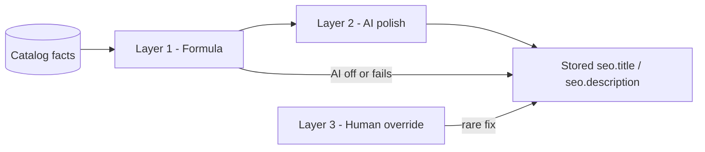

# SEO / AIO / GEO automation plan

Intent Surface Engine for Sister's Outfits: automated discovery for attribute-matrix commerce without indexing every variant combination as a separate URL.

**Status (2026-07-14):** Grades were removed from the catalog. Intent surfaces are **category × brand** only; grade glossary routes and `grade` filter params are gone. Treat grade mentions below as historical plan notes — follow [README §12](../README.md#12-storefront-seo-shipped) for current behavior.

**Decisions locked (2026-07-06):**

| Decision                | Choice                                                                                        |
| ----------------------- | --------------------------------------------------------------------------------------------- |
| Primary goals (6-month) | Google organic, AI search citations (GEO/AIO), and Google/Meta Shopping equally               |
| Intent page coverage    | Qualifying `category × brand` combos (see index eligibility); grade axis retired              |
| Copy generation         | **Formula first** → AI polish on save → human override only when wrong                        |
| Admin SEO role          | Review and fix exceptions — staff do not author titles/descriptions at scale                  |
| Legacy plugins          | Yoast/Rank Math patterns (manual meta boxes) do not fit this catalog; SEO is a catalog output |

---

## 1. Problem framing

Variant-heavy catalogs cannot be SEO'd manually. One indexable URL per attribute combination (e.g. 500 pages per phone) creates thin duplicate content and cannibalization, not better rankings.

Staff cannot write good titles for hundreds of products — and should not have to. The platform must derive search copy from live catalog data (prices, grades, stock, attributes), optionally polish with AI, and expose admin as preview + regenerate + rare override.

**Correct split:**

| Layer   | What people search                           | What we index                                                          |
| ------- | -------------------------------------------- | ---------------------------------------------------------------------- |
| Intent  | "used iPhone 15 PTA", "like new Samsung S24" | Category + filter landing pages                                        |
| Product | "iPhone 15 price Sister's Outfits"           | One PDP per product                                                    |
| SKU     | "iPhone 15 256GB black grade A"              | Merchant feed + JSON-LD `hasVariant` — not separate indexable web URLs |

**Variant URL policy (ban-safe, shipped):**

| URL type                        | Indexed?                     | Title/copy                                        | Canonical        |
| ------------------------------- | ---------------------------- | ------------------------------------------------- | ---------------- |
| Clean PDP `/{category}/{slug}`  | Yes (unless staff `noindex`) | Aggregate formula (all in-stock grades/prices)    | Self             |
| PDP with `?grade=&storage=`     | **No** (`noindex,follow`)    | Runtime variant-specific (WhatsApp/social shares) | Clean PDP        |
| Intent surface `?brand=&grade=` | Yes when eligible            | Stored `SeoSurface` copy                          | Self             |
| Merchant feed row               | N/A (Shopping/Meta)          | Per-variant title                                 | Variant PDP link |

**Why not stored SEO per variant combo:** duplicate-content risk, cannibalization, and Google/Merchant policy violations on thin near-duplicate pages. One indexable PDP + feed rows + intent landings captures demand without hundreds of URLs per phone.

**Current codebase (baseline, phases 1–4 shipped):**

- One PDP at `/{category}/{slug}`; variants as query params (`?grade=…&attr.*=…`).
- Sitemap: categories, products, glossary (`/grades/{category}/{grade}`, `/attributes/{category}/{attribute}`), and indexable `category × brand × grade` intent surfaces only (not bare `?brand=` URLs).
- `composeProductSeo`: variant-aware formula titles/descriptions; custom `titleTemplate` vars (`{minPrice}`, `{gradeList}`, etc.) when template is not the default.
- Product JSON-LD: `ProductGroup` + `AggregateOffer` + FAQ schema from live variant matrix.
- Category `generateMetadata`: filter-aware; intent surfaces get dedicated title/H1/intro; other filter URLs `noindex,follow` (including thin `?brand=` when a stronger brand+grade surface exists).
- `SeoSurface` model caches intent-surface copy; staff overrides (`titleOverride`, etc.) win over formula/AI regen.
- Nightly `GET /api/cron/seo-reconcile` (Bearer `CRON_SECRET`) refreshes stats/`isIndexable` and busts storefront cache.
- Merchant feed: `GET /api/feeds/merchant` (XML; `?format=csv`); optional `MERCHANT_FEED_TOKEN`.
- Admin: formula + AI on save, Regenerate actions, glossary SEO on grade/attribute save; grade/attribute changes cascade product SEO + intent surfaces.

**Differentiator:** graded inventory + condition ontology. Generic e-commerce SEO playbooks (and WordPress plugins) do not fit; glossary + live variant matrix on few high-quality surfaces is the moat.

---

## 2. Copy pipeline (three layers)

Every public page type uses the same stack. Humans almost never write from scratch.



| Layer                 | Runs                                                                             | Output                                                                       | Blocks publish?            |
| --------------------- | -------------------------------------------------------------------------------- | ---------------------------------------------------------------------------- | -------------------------- |
| **1. Formula**        | Every save; recomputed when variants/prices/stock change                         | Title + description from facts (price range, grades, attributes, store name) | No — always available      |
| **2. AI polish**      | Product publish, material variant change, combo first-seen, grade/attribute save | Natural-language title, description, FAQs/H1 intro → persisted in DB         | No — falls back to Layer 1 |
| **3. Human override** | Admin only when auto copy is wrong                                               | `seo.title` / `seo.description` override fields                              | No — optional              |

**Formula inputs (from variant matrix):** `minPrice`, `maxPrice`, `gradesInStock`, `inStockVariantCount`, `topAttributes` (e.g. PTA, 256GB, color count), `categoryLabel`, `brandName`, `storeName`.

**Example product formulas (code picks best-fit pattern per category):**

| Pattern             | Example title                                                  |
| ------------------- | -------------------------------------------------------------- |
| Price + grades      | `iPhone 15 from Rs. 185,000 - Grade A & B \| Sister's Outfits` |
| Intent + attributes | `Used iPhone 15 — PTA, 256GB, 3 colors in stock`               |
| Brand + condition   | `Apple iPhone 15 (Like New & Grade A) \| Sister's Outfits`     |

**Example product description (one sentence, formula):**

`Shop {brand} {name} from Rs. {minPrice}. {gradeList} available. {topAttributes}. Warranty and graded inspection at {storeName}.`

**Filter page formulas (Phase 3):**

| Field            | Formula example                                              |
| ---------------- | ------------------------------------------------------------ |
| Title            | `Used {brand} {category} — {grade} \| {storeName}`           |
| Meta description | Short template from combo facts (product count, price range) |
| H1 + intro       | AI on first-seen → `SeoSurface`                              |

**Focus keyword:** optional in admin; auto-derived from product name + category for checklist scoring. Not required for publish.

**Character limits:**

| Use                           | Limit                            | Notes                                                 |
| ----------------------------- | -------------------------------- | ----------------------------------------------------- |
| SERP display (checklist pass) | Title 30–60, description 120–160 | Aligns with `seoChecklist.ts`                         |
| DB storage                    | Title ≤ 200, description ≤ 320   | `SEO_META_FIELD_LIMITS` — truncate at render for SERP |

---

## 3. Architecture overview

Four automated discovery layers (downstream of copy pipeline):

```mermaid
flowchart TB
  subgraph layer1 [Layer 1 - PDP intelligence]
    PDP[Product PDP]
    PG[ProductGroup JSON-LD]
    FAQ[FAQ schema]
    AI1[AI on product publish]
  end

  subgraph layer2 [Layer 2 - Glossary]
    GR[/grades/slug]
    AT[/attributes/slug]
    AI2[AI on grade/attribute save]
  end

  subgraph layer3 [Layer 3 - Intent surfaces]
    FIL[category?brand&grade filters]
    AI3[AI on combo first-seen]
    SM[Sitemap eligibility-gated]
  end

  subgraph layer4 [Layer 4 - Shopping feed]
    FEED[Variant XML/CSV feed]
  end

  PDP --> PG
  PDP --> FAQ
  AI1 --> PDP
  GR --> FIL
  AT --> FIL
  AI2 --> GR
  AI3 --> FIL
  FIL --> SM
  PDP --> FEED
```

---

## 4. Build phases

### Phase 1 — PDP intelligence (foundation)

_Ship first. Improves all three channels without new routes. Formula layer before AI wiring._

| Task                   | Detail                                                                                                                                                                                                                                                |
| ---------------------- | ----------------------------------------------------------------------------------------------------------------------------------------------------------------------------------------------------------------------------------------------------- |
| Variant-aware formulas | Extend `composeProductSeo` with `buildProductSeoFacts(product)` → min/max in-stock price, grade list, attribute summary. Feed into title/description patterns (§2). Expose new template vars (`{minPrice}`, `{gradeList}`, etc.) via `titleTemplate`. |
| JSON-LD upgrade        | `productJsonLd` → `ProductGroup` + `hasVariant` / `AggregateOffer` so all in-stock configs appear on one canonical URL. Match visible on-page facts block or risk rich-result drop.                                                                   |
| FAQ schema             | Auto from grade copy, warranty, attribute labels on PDP.                                                                                                                                                                                              |
| Visible facts block    | Human-readable "specs at a glance" mirroring JSON-LD (GEO citation bait).                                                                                                                                                                             |
| AI on product publish  | Layer 2: facts block in prompt → `seo.title`, `seo.description`, 3–5 FAQs → persist in `product.seo`.                                                                                                                                                 |
| Template fallback      | Layer 1 formula always live; AI failure never blocks publish.                                                                                                                                                                                         |
| Admin UX reframe       | SEO tab = **preview** (SERP + social), "Auto-generated" / "AI-generated" badge, one-click **Regenerate**, overrides labeled "Fix only if wrong". Hide focus-keyword guilt for empty field.                                                            |

**Phase 1 gate:** validate Product/FAQ rich results in Search Console before scaling Phase 3.

**Touch files:** `packages/shared/src/seo/composeSeoMeta.ts` (new facts helper), `apps/web/src/lib/seo/jsonLd.ts`, `apps/web/src/app/[category]/[slug]/page.tsx`, `apps/admin/src/app/settings/_components/SeoPanel.tsx`, `CatalogSeoPanel.tsx`, admin product save hook, new AI job module.

---

### Phase 2 — Grade and attribute glossary

_GEO moat; internal links from every PDP and filter page._

| Task                 | Detail                                                                                                         |
| -------------------- | -------------------------------------------------------------------------------------------------------------- |
| Public routes        | `/grades/{slug}`, `/attributes/{slug}` from existing admin content.                                            |
| Formula + AI on save | Title: `What is {grade}? \| {storeName}`. AI expands grade/attribute records into glossary prose + FAQ schema. |
| Collection JSON-LD   | `ItemList` of in-stock products per grade/attribute.                                                           |
| Sitemap              | All active grades and attributes.                                                                              |
| Internal linking     | PDP and filter pages link to relevant glossary entries.                                                        |

**Touch files:** new `apps/web/src/app/grades/[slug]/page.tsx`, `apps/web/src/app/attributes/[slug]/page.tsx`, `apps/web/src/app/sitemap.ts`, grade/attribute admin save hooks.

---

### Phase 3 — Intent surfaces (quality-gated)

_All qualifying `category × brand × grade` combos — not merely stock ≥ 1._

| Task                    | Detail                                                                                                                                                                   |
| ----------------------- | ------------------------------------------------------------------------------------------------------------------------------------------------------------------------ |
| Filter-aware metadata   | Category `generateMetadata` reads `searchParams` (brand, grade, attributes).                                                                                             |
| Canonical normalization | Self-referencing canonical **includes full query string** for indexed combos. Fixed param order (`brand` before `grade`). Non-whitelisted param combos → `noindex`.      |
| Unique copy per combo   | Formula title/meta + AI H1 + intro on first-seen → `SeoSurface`.                                                                                                         |
| `SeoSurface` store      | Keyed by `categorySlug + brandSlug + gradeSlug` (+ optional attribute axes later). Cache copy; invalidate on stock/catalog change.                                       |
| Index eligibility       | All rules must pass before `index` + sitemap (see table below).                                                                                                          |
| Sitemap expansion       | Products + categories + brand filters + eligible combos. Optional cap: prioritize by stock depth / product count if total URLs exceed budget (e.g. 5k).                  |
| Collection JSON-LD      | `CollectionPage` + `ItemList` per filter surface.                                                                                                                        |
| Cannibalization         | Clear title/H1 hierarchy: brand-only vs brand+grade. Breadcrumbs parent → child. Data-driven `noindex` on thin brand-only pages when stocked grade child exists (later). |

**Index eligibility matrix (all required):**

| Rule              | Threshold                                                        |
| ----------------- | ---------------------------------------------------------------- |
| In-stock variants | ≥ 3 across the combo                                             |
| Distinct products | ≥ 2                                                              |
| Copy exists       | Formula title + (`SeoSurface` intro OR category has description) |
| Canonical         | Normalized query string matches whitelist                        |
| Stock             | Re-check nightly; zero stock → `noindex` + drop from sitemap     |

**Risk:** aggressive URL count only works with aggressive **quality** controls. One unit in stock = not indexable.

**Touch files:** `apps/web/src/app/[category]/page.tsx`, `apps/web/src/app/sitemap.ts`, new `packages/db` model `SeoSurface`, cron or event-driven combo generator.

---

### Phase 4 — Shopping feed

_SKU-level discovery without extra web URLs._

| Task               | Detail                                                                                                                                                                             |
| ------------------ | ---------------------------------------------------------------------------------------------------------------------------------------------------------------------------------- |
| Feed format        | XML/CSV: one row per in-stock variant (grade, attributes, price, image, availability).                                                                                             |
| Link target        | PDP URL with correct query params (`productHref` / `productAbsoluteUrl`).                                                                                                          |
| Used/refurb fields | `condition` (used/refurbished), accurate `availability`, stable variant `id`, `identifier_exists` when no GTIN. Align with Google Merchant product data spec for used electronics. |
| Destinations       | Google Merchant Center, Meta catalog.                                                                                                                                              |
| Refresh            | On product/variant save + scheduled reconciliation.                                                                                                                                |

**Note:** Feed approval is often the Shopping bottleneck — not feed generation.

**Touch files:** new `apps/web/src/app/api/feeds/merchant/route.ts` or static generation job; shared serializer from variant matrix.

---

## 5. AI batch — guardrails

| Rule                                              | Why                                                                  |
| ------------------------------------------------- | -------------------------------------------------------------------- |
| Store output in DB; never call AI at request time | Fast pages, predictable latency and cost                             |
| Facts block required in every prompt              | "Use only these facts. Do not invent specs."                         |
| Regenerate on catalog drift                       | Variants, prices, stock, grade labels/copy, attribute labels         |
| SERP limits enforced post-generation              | Title ≤ 60, description ≤ 160 for checklist pass; truncate at render |
| Formula fallback always                           | Publish never blocked                                                |
| Admin: badge + Regenerate + override              | Review workflow, not authoring workflow                              |
| Log prompt version + model id per generation      | Audit and rollback                                                   |

**Trigger matrix:**

| Event                                         | Layer 1 (formula)      | Layer 2 (AI)                                            |
| --------------------------------------------- | ---------------------- | ------------------------------------------------------- |
| Product publish / material variant change     | Recompute immediately  | `seo.title`, `seo.description`, PDP FAQs                |
| Price or stock change (material)              | Recompute              | Regenerate if title/description references price/grades |
| Grade / attribute save                        | Glossary title formula | Glossary body, glossary FAQs                            |
| Grade label or copy change                    | —                      | Regenerate affected product FAQs + filter intros        |
| New eligible combo (category × brand × grade) | Filter title + meta    | H1 + intro → `SeoSurface`                               |

---

## 6. Guarantees & Separation

To ensure the storefront UX and data integrity remain pristine, the SEO pipeline guarantees:

| Guarantee               | Enforcement                                                                                                                                        |
| ----------------------- | -------------------------------------------------------------------------------------------------------------------------------------------------- |
| **Strict Separation**   | SEO generation writes exclusively to `seo.title` and `seo.description`. It **never** modifies `product.name`, H1 tags, variants, or storefront UI. |
| **Override Supremacy**  | A manual override in the admin `SeoPanel` **always** wins. Automated regeneration will never overwrite a human-provided value.                     |
| **Writing Style Rules** | AI prompts must enforce `writing-style.md` (plain ASCII, no emojis, no marketing fluff, no invented specs).                                        |
| **Length Validation**   | Generated copy must pass `seoChecklist.ts` length limits before saving to the DB.                                                                  |

---

## 7. Copy source reference

| Field                                     | Layer 1 (formula)      | Layer 2 (AI)          | Layer 3 (human)   |
| ----------------------------------------- | ---------------------- | --------------------- | ----------------- |
| Product title                             | Always (variant-aware) | Polish on publish     | Override if wrong |
| Product meta description                  | Always                 | Polish on publish     | Override if wrong |
| PDP FAQ schema                            | —                      | Primary               | —                 |
| Filter page title / meta                  | Primary                | Polish optional       | Override if wrong |
| Filter page H1 + intro                    | —                      | Primary on first-seen | Override if wrong |
| Glossary title                            | Primary                | —                     | Override if wrong |
| Glossary body                             | —                      | Primary on save       | Override if wrong |
| `CollectionPage` / `ProductGroup` JSON-LD | Template only          | No                    | No                |
| Sitemap / index rules                     | Rule engine only       | No                    | No                |

---

## 8. Success metrics

| Channel        | Signal                                                                                                   | Horizon                                   |
| -------------- | -------------------------------------------------------------------------------------------------------- | ----------------------------------------- |
| Google organic | Impressions/clicks on category, filter, PDP URLs in Search Console; rich result coverage for Product/FAQ | 6 months                                  |
| GEO / AIO      | Glossary citations; branded queries in Perplexity/ChatGPT; AI crawler referrers (noisy)                  | 12 months — less predictable than organic |
| Shopping       | Feed approval rate; impression share per variant row; ROAS                                               | 6 months                                  |

---

## 9. Out of scope (for now)

- Per-variant indexable URLs (query-param or path-based) beyond selective intent combos.
- Manual title/description authoring at scale (Yoast-style workflow).
- i18n / Urdu duplicate surfaces.
- Automated backlink or content-farm generation.
- Real-time AI copy on every HTTP request.

---

## 10. Implementation notes

- **Order:** Phase 1 formulas → Phase 1 AI → Phase 2 (parallel OK) → Phase 3 → Phase 4.
- Add `SeoSurface` before Phase 3.
- Phase 2 should precede or ship parallel with Phase 3 so filter pages link into glossary (GEO internal graph).
- README domain section: update when behavior ships (sitemap shape, new public routes, robots rules, index eligibility).
- Reuse `seoChecklist.ts` for admin score; score reflects auto-generated copy, not manual keyword stuffing.

---

## 11. Related code

| Area              | Path                                                   |
| ----------------- | ------------------------------------------------------ |
| SEO composition   | `packages/shared/src/seo/composeSeoMeta.ts`            |
| Title template    | `packages/shared/src/seo/titleTemplate.ts`             |
| SEO checklist     | `packages/shared/src/seo/seoChecklist.ts`              |
| SEO field limits  | `packages/shared/src/seo/seoMeta.ts`                   |
| JSON-LD           | `apps/web/src/lib/seo/jsonLd.ts`                       |
| PDP metadata      | `apps/web/src/app/[category]/[slug]/page.tsx`          |
| Category metadata | `apps/web/src/app/[category]/page.tsx`                 |
| Sitemap           | `apps/web/src/app/sitemap.ts`                          |
| Product URLs      | `apps/web/src/lib/catalog/productPaths.ts`             |
| Admin SEO panel   | `apps/admin/src/app/settings/_components/SeoPanel.tsx` |
| Admin SEO preview | `apps/admin/src/lib/seo/resolveCatalogSeo.ts`          |
