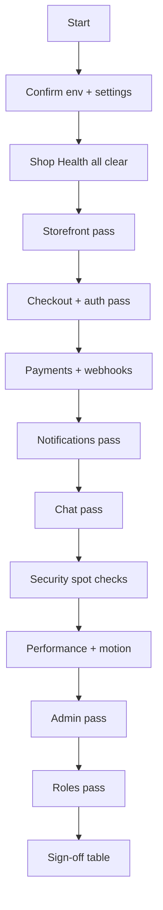
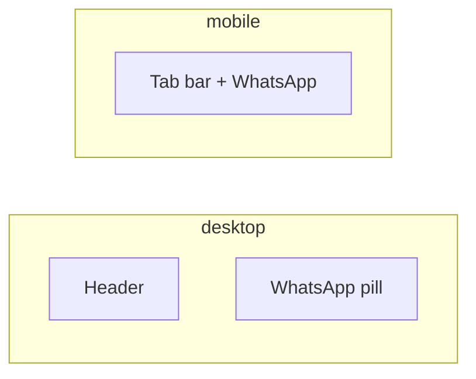
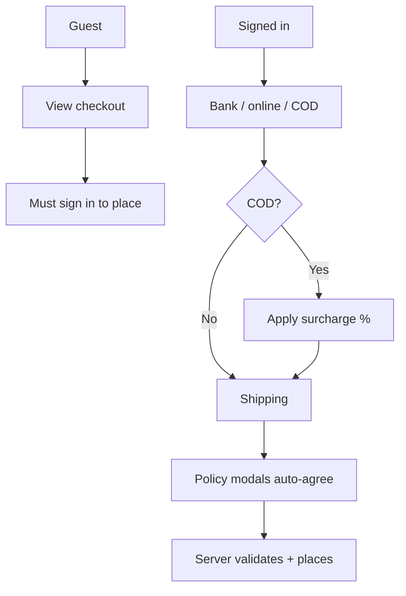
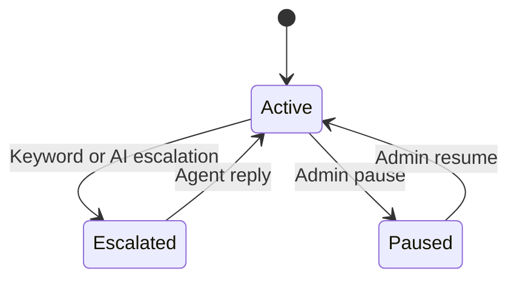
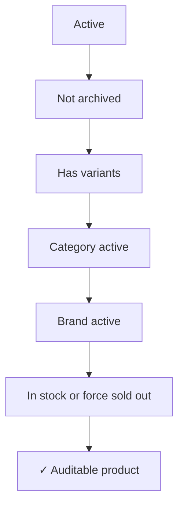
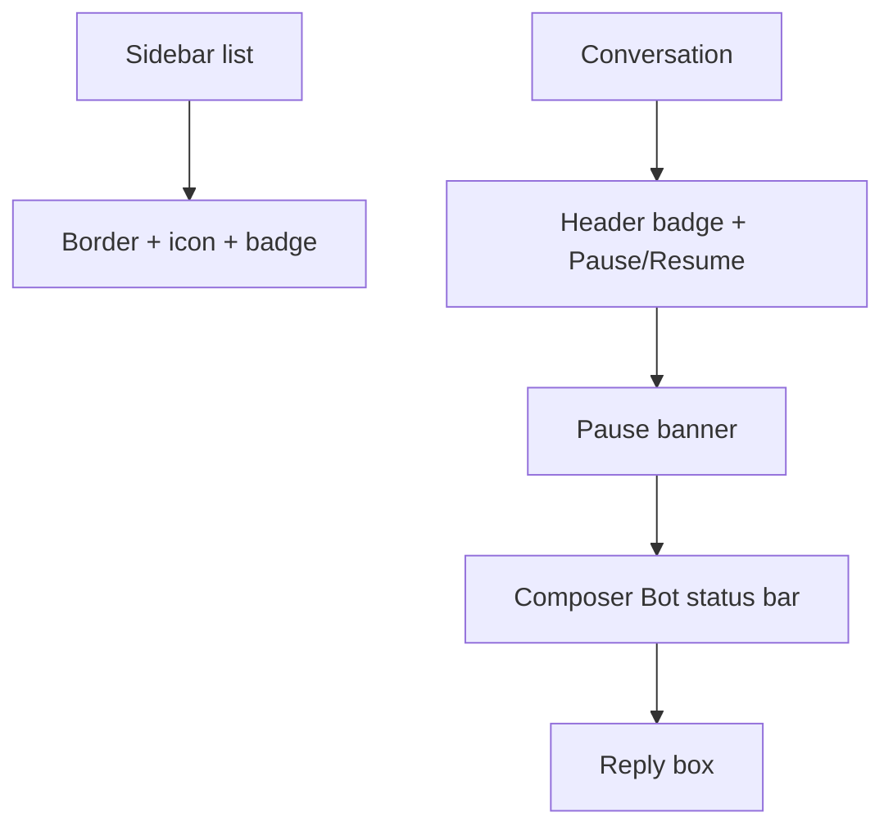
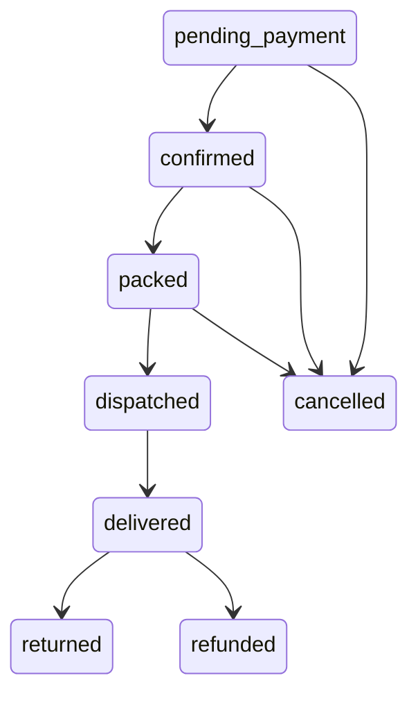

# Website audit guide

Checklist for auditing the live storefront and admin console before or after public launch. Each section: **what to verify**, **where it is configured**, **expected behavior**.

| Doc          | Link                               |
| ------------ | ---------------------------------- |
| Domain rules | [README.md](../README.md)          |
| Go-live      | [go-live.md](go-live.md)           |
| Setup        | [setup.md](setup.md)               |
| Architecture | [architecture.md](architecture.md) |
| Catalog      | [catalog.md](catalog.md)           |

---

## Audit flow

---

## Before you start

| Step | Action                                                                 |
| ---- | ---------------------------------------------------------------------- |
| 1    | Run on **production URLs** (or staging with production-like data).     |
| 2    | Sign in as **Owner** (admin) and **customer** (OTP on storefront).     |
| 3    | **Settings → Site URLs** matches the URL under test.                   |
| 4    | Note toggles: chat enabled, payment methods, assistant, notice banner. |
| 5    | Open **Dashboard → Shop Health** — resolve `error` items first.        |

---

## Shop Health (admin dashboard)

| Check               | Expected                                                     |
| ------------------- | ------------------------------------------------------------ |
| No `error` severity | Payments enabled; bank details if bank transfer on           |
| Notifications       | Resend + WhatsApp + both template names when alerts expected |
| Card gateway        | PayFast/Rapid ready when pay online enabled                  |
| Rapid webhook       | Webhook secret set when Rapid is active provider             |
| Catalog hygiene     | No active products without images (warn)                     |

---

## Storefront — global shell

| Check              | Expected                                                                   | Config                   |
| ------------------ | -------------------------------------------------------------------------- | ------------------------ |
| Desktop header     | Home and Shop; centered brand; Search, Account, and Bag                    | Header                   |
| Mobile tabs        | Home, Deals, **WhatsApp**, Cart, Account                                   | MobileBottomTabBar       |
| WhatsApp support   | Contextual page URL from the floating desktop pill or center mobile action | `whatsappNumber`         |
| Unavailable number | Desktop pill hidden; mobile WhatsApp action disabled                       | `whatsappNumber`         |
| Notice banner      | When enabled; hidden on editorial homepage and dismissible elsewhere       | Settings → Notices       |
| Moneyback badge    | Checkout header shows configured days                                      | Settings → Policies      |
| Nav progress       | Top bar on internal link clicks                                            | Built-in                 |
| Scroll reveals     | Elements fade/slide in on scroll                                           | `.reveal` classes        |
| Reduced motion     | OS setting shortens/skips animation                                        | `prefers-reduced-motion` |

---

## Storefront — routes

| Route                          | Verify                                                              |
| ------------------------------ | ------------------------------------------------------------------- |
| `/`                            | Boutique homepage; `?q=` switches to the paginated search grid |
| `/{category}`                  | URL filters; inactive → coming soon                                 |
| `/{category}/{slug}`           | PDP gallery, configurator, deals, grade showcase, mobile buy bar    |
| `/deals`                       | Deal pills + checkout chips + product grid                          |
| `/cart`                        | 20 lines / 10 qty limits; offer preview                             |
| `/checkout`                    | Guest preview + sign-in gate; signed-in full flow                   |
| `/checkout/success`            | Auth + order param; payment copy when total > 0                     |
| `/concepts/typography`         | Internal typography study; excluded from search indexing            |
| `/concepts/quiet-gallery`      | Internal noindex quiet fashion gallery homepage study               |
| `/concepts/textile-exhibition` | Internal noindex textile exhibition homepage study                  |
| `/concepts/couture-salon`      | Permanent redirect to `/`                                           |
| `/concepts/shop`               | Redirects to live category listing (Gate · hang tags promoted)      |
| `/account`                     | Dashboard, orders, loyalty                                          |
| `/account/sign-in`             | OTP; `?next=` redirect                                              |
| `/account/profile`             | Name, city, addresses                                               |

---

## Storefront — checkout

| Check           | Expected                                                                               |
| --------------- | -------------------------------------------------------------------------------------- |
| Payment methods | **Bank transfer**, **pay online**, **COD** — per admin toggles                         |
| Method toggles  | Disabled methods hidden + rejected server-side                                         |
| Bank transfer   | Chip hidden until bank name + account configured                                       |
| COD surcharge   | % from Settings → Payments on subtotal after offers                                    |
| Pay online      | PayFast or Rapid redirect; webhook confirms with amount                                |
| Pickup          | Free + store hours                                                                     |
| Courier         | Configured fee unless subtotal ≥ free-delivery threshold or offer grants free shipping |
| Policies        | Modal HTML; no agreement checkbox                                                      |
| Loyalty         | Min 100 pts; max 20% subtotal; offer may block                                         |
| Placement       | Idempotency key required; 5 orders / 15 min; server prices only                        |
| Tamper test     | Change price in DevTools cart → server rejects or recalculates                         |

---

## Storefront — notifications (live test)

| Event                 | Staff email | Staff WhatsApp | Customer WhatsApp |
| --------------------- | :---------: | :------------: | :---------------: |
| Place COD order       |      ☐      |       ☐        |         ☐         |
| Status change (admin) |      ☐      |       ☐        |         ☐         |
| Pay online confirmed  |      ☐      |       ☐        |         ☐         |
| Customer cancel       |      ☐      |       ☐        |         ☐         |
| Customer chat message |      ☐      |       ☐        |        n/a        |
| Agent reply           |     n/a     |      n/a       |         ☐         |

---

## Storefront — chat

| Check        | Expected                                                    |
| ------------ | ----------------------------------------------------------- |
| Entry        | Desktop FAB; mobile Support tab                             |
| Guest limit  | 5 messages → sign-in gate                                   |
| Assistant    | Auto-reply; typing pace; speak-to-someone hint              |
| Escalation   | Admin **Escalated** badge + customer banner; staff notified |
| Manual pause | **Bot off** badge; bot silent until Resume                  |
| All pages    | Chat on checkout & sign-in when enabled                     |
| Nudge        | After idle minutes; dismissible                             |

---

## Storefront — catalog visibility

---

## Security spot checks

| Check                        | How to verify                                            |
| ---------------------------- | -------------------------------------------------------- |
| Offer abuse                  | Submit expired offer ID → 400/rejected                   |
| Double submit                | Rapid double-click Place order → one order (idempotency) |
| Cancel auth                  | Cancel another customer's order ID → 404/403             |
| Admin without permission     | Support staff POST product → 403                         |
| Webhook forgery              | POST fake webhook without signature → rejected           |
| Session after password reset | Old admin cookie invalid after reset                     |

---

## Performance spot checks

| Check                 | Expected                                                  |
| --------------------- | --------------------------------------------------------- |
| First navigation      | Progress bar visible; no full white flash                 |
| Category back         | Fast return (router stale cache)                          |
| PDP images            | Optimized format (Network tab: avif/webp)                 |
| Lighthouse (optional) | LCP reasonable on 4G; no giant client JS from `@store/db` |

---

## Admin — workspaces

| Route         | Permission        | Focus                                        |
| ------------- | ----------------- | -------------------------------------------- |
| `/`           | Session           | KPIs, **Shop Health**, alerts                |
| `/orders`     | `order_view`      | Stepper, pending edits, cancel, bank confirm |
| `/inquiries`  | `inquiry_view`    | Pause/resume, reply, alerts                  |
| `/customers`  | `customer_view`   | Loyalty, sign-in code                        |
| `/products`   | `product_view`    | Wizard, variants, SEO                        |
| `/categories` | `category_manage` | Brands, grades, attributes                   |
| `/offers`     | `offer_manage`    | Catalog vs checkout scope                    |
| `/settings`   | `settings_view`   | All tabs + Integrations                      |
| `/team`       | `team_view`       | Roles                                        |
| `/activity`   | `activity_view`   | Audit log                                    |

---

## Admin — inquiries

| Check        | Expected                                       |
| ------------ | ---------------------------------------------- |
| List         | Signed-in customers only                       |
| Sidebar      | **Bot off** or **Escalated** on paused threads |
| Composer bar | **Bot status: Paused** above reply field       |
| Manual pause | Survives agent reply                           |
| Escalation   | Clears on agent reply unless manual pause      |
| Attachments  | JPEG, PNG, WebP, PDF, plain text               |

---

## Admin — settings tabs

| Tab             | Verify                                                      |
| --------------- | ----------------------------------------------------------- |
| Site URLs       | Public storefront URL                                       |
| Store / Contact | Branding, phones, WhatsApp, hours                           |
| Payments        | Bank / pay online / COD toggles, bank details, COD %, notes |
| Delivery        | Free-shipping threshold + courier fee                       |
| Notices         | Delivery note, banner                                       |
| Policies        | Moneyback, warranty, return/privacy HTML                    |
| Loyalty         | Earn %, bonuses                                             |
| Inventory       | Low-stock threshold                                         |
| Chat            | Widget, assistant, guest limit, nudge                       |
| Integrations    | PayFast/Rapid, WhatsApp, Resend, templates, pixels, storage |
| Cleanup         | Owner-only + confirmation phrase                            |

---

## Admin — roles

| Role              | Should access          | Blocked                     |
| ----------------- | ---------------------- | --------------------------- |
| Owner             | All + delete + cleanup | —                           |
| Business manager  | Ops + settings         | Team, cleanup, order delete |
| Support staff     | Read + inquiry reply   | Writes on catalog/orders    |
| Product manager   | Catalog + media        | Orders, settings            |
| Marketing manager | Offers, categories     | Product edit                |

---

## Orders lifecycle

| Status                   | Verify                                                               |
| ------------------------ | -------------------------------------------------------------------- |
| `pending-payment`        | Bank transfer or pay online before confirm; editable; stock reserved |
| `confirmed`              | COD on place; bank after admin confirm; card after webhook           |
| `packed`                 | Dispatch video required                                              |
| `delivered`              | Loyalty credited                                                     |
| `cancelled` / `refunded` | Stock released; loyalty rules apply                                  |
| Customer cancel          | From account while `pending-payment` or `confirmed`                  |

---

## Offers

| Type           | Where                 | Rule                                                 |
| -------------- | --------------------- | ---------------------------------------------------- |
| Catalog deal   | Deals, cards, PDP     | One per product max; locked at add-to-cart           |
| Checkout offer | Chips, cart, checkout | One per order; may block loyalty; server eligibility |
| COD surcharge  | Checkout              | Separate admin % on COD — not an offer               |

---

## Sign-off

| Area                               | Pass | Notes |
| ---------------------------------- | ---- | ----- |
| Shop Health                        | ☐    |       |
| Global shell + navigation + motion | ☐    |       |
| Catalog + PDP                      | ☐    |       |
| Cart + checkout + success          | ☐    |       |
| Payments + webhooks                | ☐    |       |
| Notifications                      | ☐    |       |
| Auth + account                     | ☐    |       |
| Chat + pause + escalation          | ☐    |       |
| Security spot checks               | ☐    |       |
| Performance                        | ☐    |       |
| Deals + loyalty                    | ☐    |       |
| Admin orders + customers           | ☐    |       |
| Admin inquiries                    | ☐    |       |
| Admin settings + integrations      | ☐    |       |
| Roles + permissions                | ☐    |       |

**Launch approved when:** all `error` Shop Health items resolved, sign-off rows checked, one real order completed on production.
